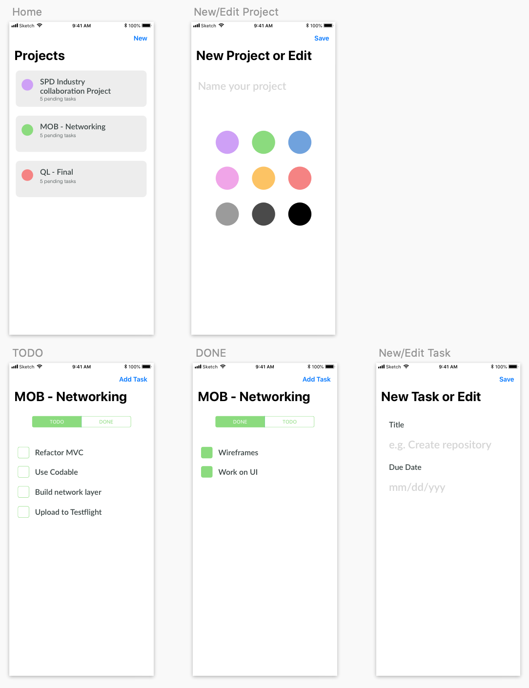
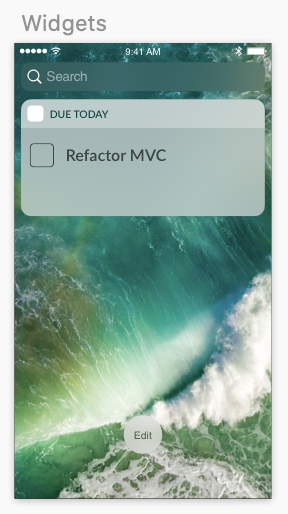

# Project - Taskee App

We will be building an app to help people manage projects.

As a user, I should be able to add a new project with a name and a color for personal reference. A **Project** can have multiple **Tasks**.

I should be able to add tasks to projects with a title and an end date.

As a user I change the status of tasks. 
- I can view the list of **TODO** items inside a project (tasks that haven't been marked as completed). 
- I can view the list of **DONE** items inside a project (tasks that have been marked as completed). 

I should be able to edit any existing tasks and projects.

## Code Quality Requirements

You know how to store trivial information in Core Data. The purpose of this project is for you to develop a professional working application with Core Data. Think about your architectural choices and focus on code quality.

Your code will be examined on these categories:

- Code modularizaton
- Commenting Code
- The use of simple abstractions
- Use of the Core Data Stack
- Performance of code
- Swift style guide & Tools (Protocols, Enums etc)

## Entities
- Project
    - Name
    - Color
    - Has many tasks
- Task
    - Belongs to a Project
    - Title
    - Due Date
    - Status

## Requirements

- Use Core Data for persistence.

## UI

The interface is up to you to decide. I have provided a sample design, but you are free to experiment with your own interpretations.

## Extra Challenges

- Add a search bar in the home page to find tasks.
- Task reminder; send a local notification a day before a task is due.
- Create a widget companion for the app:

