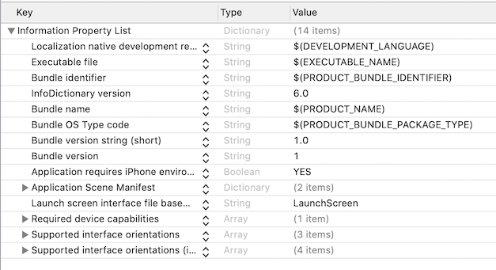
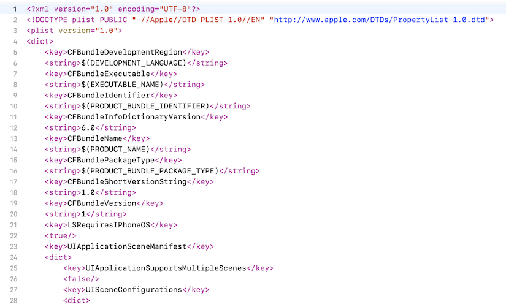
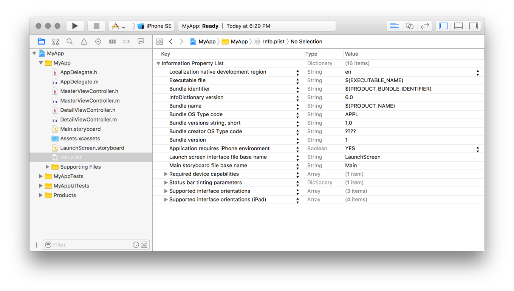

<!-- Run this slideshow via the following command: -->
<!-- reveal-md README.md -w -->


<!-- .slide: class="header" -->

# NSUserDefaults & Plist

## [Slides](https://make-school-courses.github.io/MOB-2.1-Local-Persistence-in-iOS/Slides/Lesson2/README.html ':ignore')

<!-- > -->

## Agenda

- Objectives
- Plist
- Activity
- NSUserDefaults
- Activity w/property wrappers

<!-- > -->

## Learning Objectives

By the end of this lesson, we should be able to...

- Identify use cases for persisting information in a plist.
- Use a plist to store and retrieve data.
- Identify use cases for persisting information with UserDefaults in iOS
- Use UserDefaults to store and retrieve data.
- Familiarize with property wrappers.

<!-- > -->

## The plist

A **property list**, or **plist**, is an XML file that contains **key-value** data.

<!-- > -->

In iOS, a common plist is the `Info.plist` file.

An information property list file is a structured text file that contains essential configuration information for a bundled executable.

<!-- > -->



<!-- > -->

Typically the contents are structured using XML. The root XML node is always an **array or a dictionary**, whose contents are a set of **keys and values** describing the bundle.

These values are used by the system to obtain information about the app and its configuration.

<!-- > -->



<!-- > -->

The file is called `Info.plist` by convention. The file name is case sensitive so it should have a capital letter I.

The file is created automatically by Xcode when you create a new project.

<!-- > -->

### Creating an Information Property List File

The easiest way to create an information property list file is letting Xcode create it for us.

Every project we create in Xcode comes with a file named `Info.plist`.

The file comes preconfigured with keys that every plist should have.

<!-- > -->

To edit the contents of the file:

1. Select the file in files inspector.
1. Double-click the value to select it and type a new value.

Most of these values are specified as strings but Xcode also supports other types likes arrays, dictionaries, booleans, date, data and numbers.

<!-- > -->



This is an example of a default plist that gets created with every new project. To see the XML structure, we right-click on the file and choose Open As/ Source Code.

<!-- > -->

### Adding keys

The default `Info.plist` file given by Xcode has the required keys, but it's possible that you will need to add more for your project. We can use the plist as a key-value data store.

- To add a new item, right-click on the editor and select *Add Row*.
- To change the value's type, click on the select button in the Type column.
- To change the value, double-click on the Value column.
- To remove a row, select it and hit Backspace.

<!-- > -->

### Reading from a plist

Here's how to read the information:

```Swift
var format = PropertyListSerialization.PropertyListFormat.xml
var data:[String:AnyObject] = [:]
let path:String? = Bundle.main.path(forResource: "name of your plist", ofType: "plist")!
let xmlContents = FileManager.default.contents(atPath: path!)!
do{
    data = try PropertyListSerialization.propertyList(from: xmlContents,options: .mutableContainersAndLeaves,format: &format)as! [String:AnyObject]
    // data is available now
catch{
    print("Error reading plist: \(error)")
}
```

<!-- > -->

### Writing to a plist

Aside from manually adding new elements to the plist, we can also write to it.

The issue here is that we _can't write to our app bundle_. This means we first need to to save the existing file into a Documents folder and then write and read from there.

<!-- > -->

#### What's the difference?

The **main bundle** is everything that the user gets when they install the app.
- This is read only.
- When the app is updated, the bundle gets replaced by a new one.

The **documents directory** is where everything that the user generates is stored.
- This is read/write
- Remains the same even with updates.

<!-- > -->

### Writing to a plist

We can write small helper methods to help handling plists easier.

[This suggestion](https://stackoverflow.com/questions/25100262/save-data-to-plist-file-in-swift) made on StackOverflow keeps all operations on plists contained in a single place and prevents errors

```Swift

struct Plist {

  enum PlistError: Error {

    case FileNotWritten
    case FileDoesNotExist
  }

  let name:String

  var sourcePath:String? {
    guard let path = Bundle.main.path(forResource: name, ofType: "plist") else { return nil }
    return path
  }

  var destPath:String? {
    guard sourcePath != nil else { return nil }
    let dir = NSSearchPathForDirectoriesInDomains(.documentDirectory, .userDomainMask, true)[0]
    return (dir as NSString).appendingPathComponent("\(name).plist")
  }

  init?(name:String) {

    self.name = name

    let fileManager = FileManager.default

    guard let source = sourcePath else { return nil }
    guard let destination = destPath else { return nil }
    guard fileManager.fileExists(atPath: source) else { return nil }

    if !fileManager.fileExists(atPath: destination) {

      do {
        try fileManager.copyItem(atPath: source, toPath: destination)
      } catch let error as NSError {
        print("Unable to copy file. ERROR: \(error.localizedDescription)")
        return nil
      }
    }
  }


  func getValuesInPlistFile() -> NSDictionary?{
    let fileManager = FileManager.default
    if fileManager.fileExists(atPath: destPath!) {
      guard let dict = NSDictionary(contentsOfFile: destPath!) else { return nil }
      return dict
    } else {
      return nil
    }
  }

  func getMutablePlistFile() -> NSMutableDictionary?{
    let fileManager = FileManager.default
    if fileManager.fileExists(atPath: destPath!) {
      guard let dict = NSMutableDictionary(contentsOfFile: destPath!) else { return nil }
      return dict
    } else {
      return nil
    }
  }

  func addValuesToPlistFile(dictionary:NSDictionary) throws {
    let fileManager = FileManager.default
    if fileManager.fileExists(atPath: destPath!) {
      if !dictionary.write(toFile: destPath!, atomically: false) {
        print("File not written successfully")
        throw PlistError.FileNotWritten
      }
    } else {
      throw PlistError.FileDoesNotExist
    }
  }
}


```

<!-- > -->

## In Class Activity I

Instructions [here](https://github.com/Make-School-Courses/MOB-2.1-Local-Persistence-in-iOS/blob/master/Lessons/Lesson2/assignments/defaults.md)

<!-- > -->

## UserDefaults

UserDefaults allows us to store:
- Strings
- Numbers
- Dates
- Data
- Arrays
- Dictionaries

Keep in mind that it is a **small** amount of data what we should be storing in UserDefaults.

<!-- > -->

Usually it should be used to store user preferences, or anything as long as it's a **small amount of persistent information**.

Every piece of data we store will have a unique **key**, if we try saving things with the same key, new data will only replace the old data.

<!-- > -->

🔓 Should **never be used for sensitive data** as its not encrypted (eg. Authentication Token, passwords).

<!-- > -->

## Example

Storing a boolean indicating when a user opened an app for the first time.

```swift
// Set
UserDefaults.standard.set(false, forKey: "FirstTime")

// Get
let value = UserDefaults.standard.bool(forKey: "FirstTime")
```

<!-- > -->

## Example

Storing a string.

```swift
// Set
UserDefaults.standard.set("Karl", forKey: "name")

// Get
let name = UserDefaults.standard.string(forKey: "name") ?? ""
```

<!-- > -->

Items stored in UserDefault belong to an app. This means deleting your app will clear out its UserDefaults.

<!-- > -->

## In Class Activity II

Instructions [here](https://github.com/Make-School-Courses/MOB-2.1-Local-Persistence-in-iOS/blob/master/Lessons/Lesson2/assignments/defaults.md)

<!-- > -->

## Resources
[Plist - article](https://learnappmaking.com/plist-property-list-swift-how-to/)<br>
[Info.plist - Apple Docs](https://developer.apple.com/library/archive/documentation/General/Reference/InfoPlistKeyReference/Articles/AboutInformationPropertyListFiles.html#//apple_ref/doc/uid/TP40009254-102276)<br>
[Apple Documentation on UserDefaults](https://developer.apple.com/documentation/foundation/userdefaults)<br>
[Plist struct](https://stackoverflow.com/questions/25100262/save-data-to-plist-file-in-swift)<br>
[User defaults - exercise](https://medium.com/@nimjea/userdefaults-in-swift-4-d1a278a0ec79)<br>
[Property Wrappers](https://www.vadimbulavin.com/swift-5-property-wrappers/)
