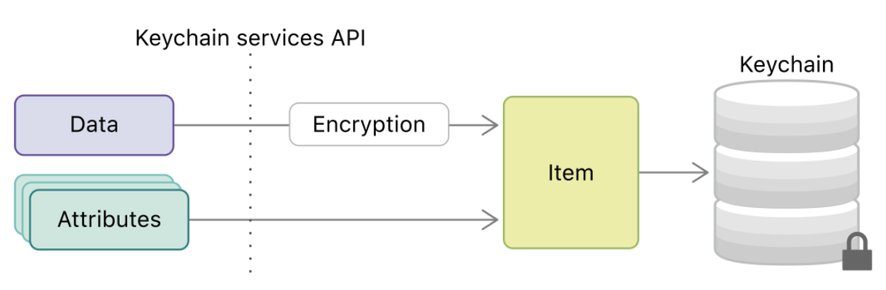
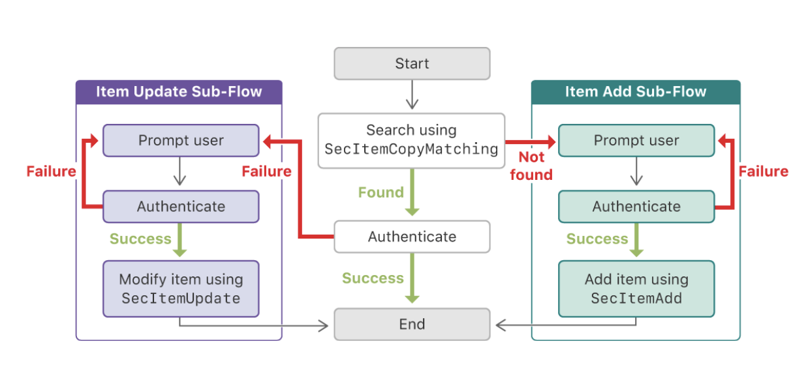

<!-- Run this slideshow via the following command: -->
<!-- reveal-md README.md -w -->


<!-- .slide: class="header" -->

# Keychain and NSCoding

## [Slides](https://make-school-courses.github.io/MOB-2.1-Local-Persistence-in-iOS/Slides/Lesson3/README.html ':ignore')

<!-- > -->

## Agenda

- Review/Complete activity w/property wrappers
- Objectives
- NSCoder 🧓🏼
- Keychain 🔐

<!-- > -->

## Learning Objectives

- Store custom objects into UserDefaults
- Describe how to handle the Keychain in iOS.
- Implement data storing/retrieval through Keychain.

<!-- > -->

## The problem

"A default object must be a property list—that is, an instance of (or for collections, a combination of instances of) **NSData, NSString, NSNumber, NSDate, NSArray, or NSDictionary**."

<aside class = "notes">
UserDefaults can only accept certain types and if we want to save a custom object into UserDefaults, we have to convert it into NSData first.
Before Apple introduced the Codable protocol, the way to convert custom object into NSData is using NSKeyedArchiver with NSCoding protocol like this:
</aside>

<!-- > -->

Before we had the `Codable` protocol, to convert a custom object into `NSData` we used `NSKeyedArchiver` with `NSCoding` protocol

<!-- > -->

## NSKeyedArchiver

NSKeyedArchiver encodes and decodes classes as long as they are **NSCoding compliant**.

NSCoding is a protocol that requires two methods — encode and decode. If we have a class that conforms to NSObject AND NSCoder, then that class can be serialized and deserialized into data that can be saved to a user’s disk.

<!-- > -->

**Encoding:** Creating a binary representation (that can be stored on disk, transferred via network) from an data structure.

**Decoding:** Creating a data structure from a binary/textual representation.

<!-- > -->

## Storing custom objects

```swift
struct Person {
    var name: String
}

```

<!-- > -->

```swift
extension Person: Codable {
    enum CodingKeys: String, CodingKey {
        case name
    }
}

```

<!-- > -->

What if we add a `favoriteColor` property to `Person`? of type `UIColor`.

<!-- > -->

```swift
struct Person {
    var name: String
    var favoriteColor: UIColor
}

extension Person: Codable {
    enum CodingKeys: String, CodingKey {
        case name
        case favoriteColor
}    
```

<!-- > -->

Check the documentation for UIColor & Person.

<!-- > -->

We need the NSKeyedArchiver

**Encoding**
```swift
func encode(to encoder: Encoder) throws {
  var container = encoder.container(keyedBy: CodingKeys.self)
  try container.encode(name, forKey: .name)

  let colorData = try NSKeyedArchiver.archivedData(withRootObject: favoriteColor, requiringSecureCoding: false)
  try container.encode(colorData, forKey: .favoriteColor)
}
```

<!-- > -->

**Decoding**

```swift
init(from decoder: Decoder) throws {
  let container = try decoder.container(keyedBy: CodingKeys.self)
  name = try container.decode(String.self, forKey: .name)

  let colorData = try container.decode(Data.self, forKey: .favoriteColor)
  favoriteColor = try NSKeyedUnarchiver.unarchiveTopLevelObjectWithData(colorData) as? UIColor ?? UIColor.purple
}

```

<!-- > -->

## Put it to use

Take the `Person` class and use it to store an instance of it in UserDefaults.

HINT: Since the Person class conforms to the Codable protocol, you can use `JSONEncoder` and `JSONDecoder` to help you on this task.

<!-- > -->

## Keychain

Apps often need access to sensitive user data such as passwords, but keeping the data secure can come at a cost:

Storing data without any encryption = **security risk!** 😰

Prompting the user all the time = **bad user experience!** 😡

<!-- > -->

Keychain services helps solve this problem by providing easy access to encrypted storage.

Your app uses the keychain, along with minimal user interaction, to provide a good user experience. 😌

<!-- > -->

The Keychain services API gives an app a mechanism to store **small bits** of user data in an **encrypted database** called a keychain. 🔐

<!-- > -->


<!-- > -->

## Things to know

- Used to store sensitive information, such as passwords or credit card information.
- Information is stored encrypted.
- Items stored in the keychain belong to a container that is shared by the operating system.
- This means that if you store a key-value pair in the keychain, and delete your app without clearing the keychain, that item will persist.

<!-- > -->

## How?

Keychain Services consists of two parts: an **encrypted database** and **items inserted** into the database .



<!-- > -->

**Keychain Use Case - Logging in a User**

Saving a password.



<!-- > -->

The keychain is automatically unlocked when the user unlocks the device and then locked when the device is locked.

> An app can access only its own keychain items, or those shared with a group to which the app belongs. It can't manage the keychain container itself. - Apple

<!-- > -->

### Terminology

- `SecKeychain` 				 - this is the database

- `SecKeychainItem			 - this is the item saved to the database`

- `SecItemAdd(_:_:)` 			 - adding an item

- `SecItemCopyMatching(_:_:)` 	 - searching for an item

- `SecItemUpdate(_:_:)` 		 - updating an item

- `SecItemDelete(_:)` 			 - deleting an item

- `kSecAttrSynchronizable`		 - make the item sync with iCloud

<!-- > -->

## KeychainSwift

Apple’s API might be complex at first - Open Source Libraries such as
[KeychainSwift](https://github.com/evgenyneu/keychain-swift) will make your life easier!

- Get, set and delete string, boolean and Data Keychain items
- Specify item access security level
- Synchronize items through iCloud
- Share Keychain items with other apps

<!-- > -->

## In Class Activity

Instructions [here](https://github.com/Make-School-Courses/MOB-2.1-Local-Persistence-in-iOS/blob/master/Lessons/Lesson3/keychain.md)

<!-- > -->

## Resources

1. [Apple Documentation on Keychain](https://developer.apple.com/documentation/security/keychain_services)<br>
1. [Apple Documentation on NSKeyedArchiver](https://developer.apple.com/documentation/foundation/nskeyedarchiver)<br>
1. [Keychain dive in - article](https://medium.com/halcyon-mobile/diving-into-keychain-services-c71782313a3c)<br>
1. [Using keychain to manage user secrets](https://developer.apple.com/documentation/security/keychain_services/keychain_items/using_the_keychain_to_manage_user_secrets)<br>
1. [Keychain items](https://developer.apple.com/documentation/security/keychain_services/keychain_items)
1. [Library used](https://github.com/evgenyneu/keychain-swift)
1. [Saving custom objects](https://fluffy.es/saving-custom-object-into-userdefaults/)
1. [Load and save from UserDefaults](https://www.hackingwithswift.com/example-code/system/how-to-load-and-save-a-struct-in-userdefaults-using-codable)
