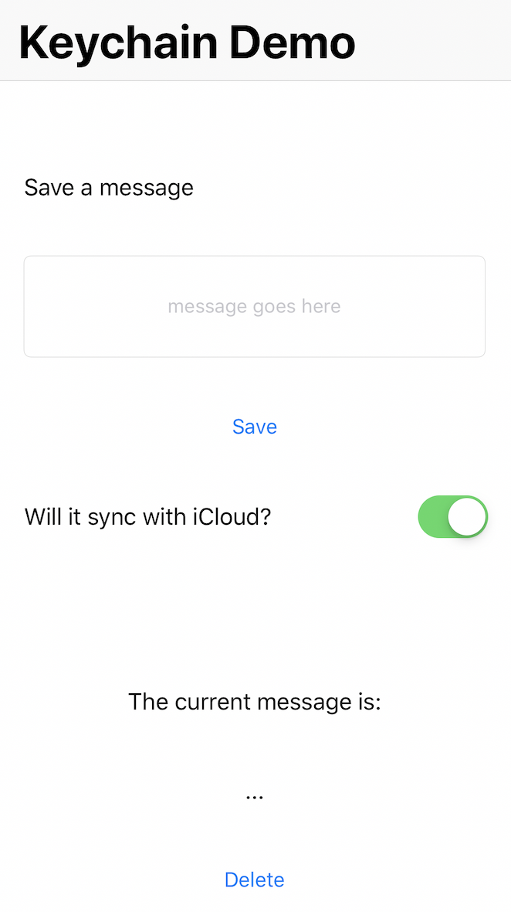

## Keychain practice

1. Some of you will add [KeychainSwift](https://github.com/evgenyneu/keychain-swift#keychain_access_groups) to a new project.

1. Some of you will add [KeychainAccess](https://github.com/kishikawakatsumi/KeychainAccess) to a new project.

1. The idea is to practice how to handle Keychain while using best practices to implement an intermediary layer between the third party library and your project.

1. To test the Persistence layer make an app that can **save, edit and delete** a message with keychain.

1. Create a very simple UI for your demo. Maybe something similar to this:
 *Ignore the Synchronize toggle*

1. We will compare implementations of both libraries and catch some tips along the way from our peers. 😀

## Stretch challenge

Write unit tests for you persistence layer.

## Additional Resources

- [Doing your own wrapper](https://www.raywenderlich.com/9240-keychain-services-api-tutorial-for-passwords-in-swift)
