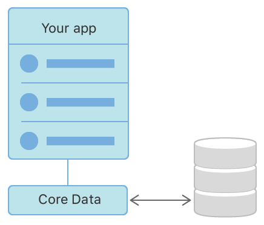
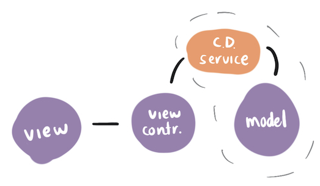
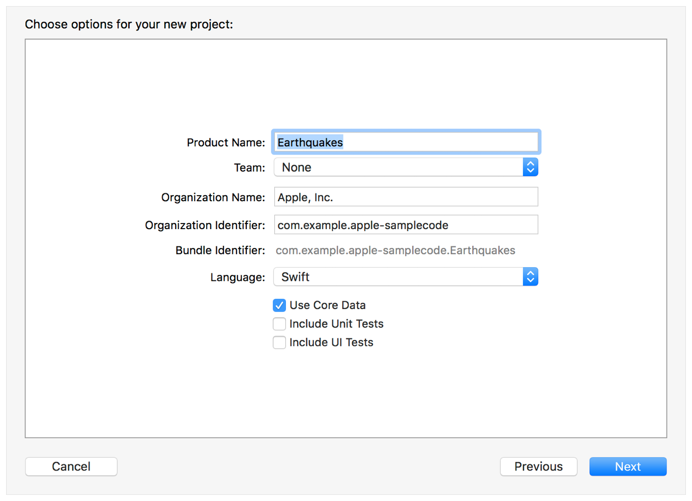
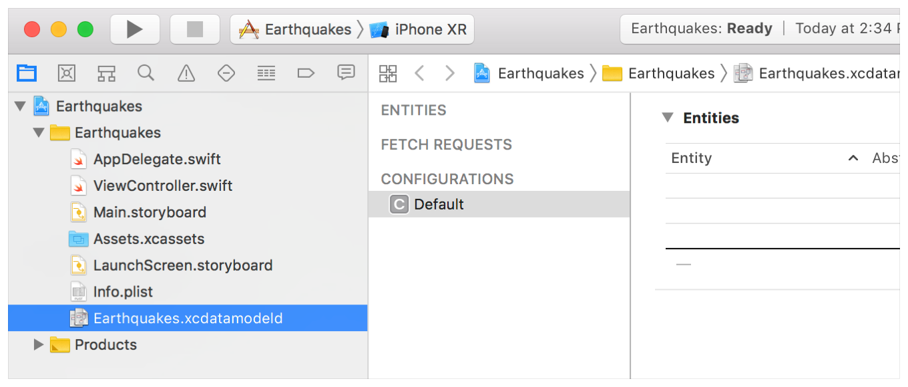
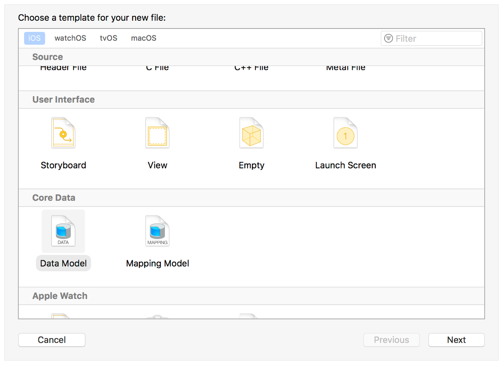
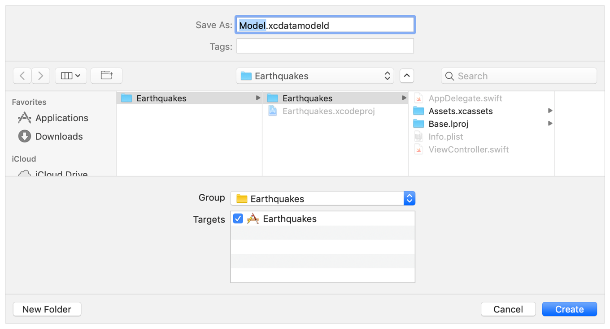
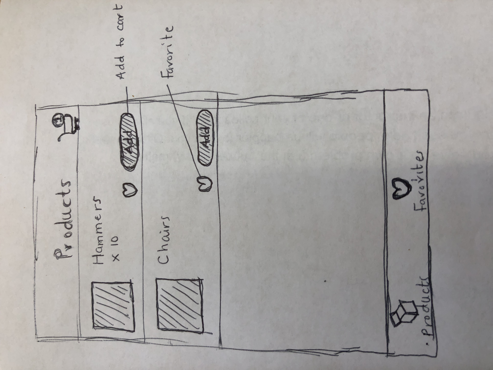

<!-- Run this slideshow via the following command: -->
<!-- reveal-md README.md -w -->


<!-- .slide: class="header" -->

# Intro to CoreData

## [Slides](https://make-school-courses.github.io/MOB-1.3-Dynamic-iOS-Apps/Slides/Lesson5/README.html ':ignore')

<!-- > -->

## Why you should know this

Sometimes we want the data in our apps to remain the same even when the app is relaunched, after a device restart or in the event iOS ejects the app from memory when not in active use. When data becomes large and more complex, Core Data is the way to go 😀

<!-- > -->

## Learning Objectives

1. Describe Core Data, what it is and how it works.
1. Design models to use with Core Data using Xcode's model editor.
1. Understand key concepts and components of the Core Data Stack.
1. Get started with Core Data in Xcode (add/fetch/display)

<!-- > -->

## What is CoreData?

Framework that we use to manage the **model layer objects** in an application.

It provides **generalized and automated solutions to common tasks associated with object life cycle and object graph management, including persistence.**

<!-- > -->

You can use Core Data to save your application’s permanent data for:

- Offline use
- To cache temporary data

<!-- > -->



<!-- > -->

Through Core Data’s Data Model editor, you define your data’s **types and relationships**, and **generate class definitions**.

Core Data can then manage object instances at runtime to provide the following features:

<!-- v -->

**Persistence**  

Core Data abstracts the details of mapping your objects to a store, making it easy to save data from Swift and Objective-C without administering a database directly.

<!-- v -->

**Background Data Tasks**  

Perform potentially UI-blocking data tasks, like parsing JSON into objects, in the background.

You can then cache or store the results to reduce server roundtrips.

<!-- > -->

**View Synchronization**

Core Data also helps keep your views and data synchronized by providing data sources for table and collection views.

<!-- > -->

## Is it a database then?

CoreData is a **framework** from Apple that allows you to create and describe your model objects and their relationships to one another.

Assumes responsibility for the lifetimes of these objects, ensuring their relationships are kept consistent and up to date.

<!-- > -->

Because these objects can be thought of as nodes, and their interrelationships as vertices in a mathematical graph, such a collection of objects is often referred to as an object graph.

<!-- > -->

## Object Graphs

Object-oriented applications contain complex webs of interrelated objects where objects are linked to each other by one object either owning, containing, or holding a reference to another object.

This web of objects is called an object graph — an abstract structure that can be used to describe an application's state at a particular point in time.

First and foremost, CoreData is a framework for managing an object graph.

<!-- > -->

## What it isn’t

As CoreData has been a source of much confusion, especially among new iOS developers, understanding what the framework is not goes along way toward understanding what it does and how to implement it.

<!-- > -->

### Not ORM

The framework borrows a few concepts from object-relational-mapping (ORM), but it is not a full ORM system (more on ORM later).

And, unlike an ORM, CoreData takes complete control of storage, but you do not have to describe things like foreign keys, a database schema, etc, CoreData handles all of that.

<!-- > -->

### Not A Database / Not SQLite

Though it can be used to manage a database, CoreData is much more than that: It manages, stores and reloads a complex object graph into memory.

Though it is most often used to persist data to a SQLite database, it is not tied to SQLite, and it can be used without any database at all.

When implemented to use SQLite, CoreData provides a layer of abstraction on top of SQLite that provides a convenient API for maintaining the relationships between records stored in the database.

<!-- > -->

## Where does it fit?



<aside class = "notes">
In the context of Apple’s definition of MVC, CoreData fits neatly as a component of your application’s Model as it potentially constitutes an entire data layer.
</aside>

<!-- > -->

## Components

**The Managed Object** — Subclasses of NSManagedObject. Used to represent the entities in your application.<br>
**The CoreData Stack** - Contains all the Core Data components you need to fetch, create, and manipulate managed objects.<br>
**SQLite** — A C-language library that implements a small, fast, full-featured and highly-reliable SQL database engine.

<!-- > -->


## In Class Activity I (25 min)

Define in your own words the following key terms and save them for future reference.

- Object Graph
- NSManagedObject
- NSManagedObjectContext
- NSPersistentStoreCoordinator
- NSPersistentStore
- NSManagedObjectModel
- NSPersistentContainer

Draw a diagram that will help you remember how these elements work together to make Core Data work.

[Worksheet](https://docs.google.com/document/d/19c2pzBkKVTdMj9aNBCDtRpFhIIzQOeNsLmIwzWjePtM/edit?usp=sharing)

<!-- > -->

## Creating a Core Data Model
The first step in working with Core Data is to create a **managed object model**, which describes the way Core Data represents data on disk. Here you define the structure of your application’s objects, including their object types, properties, and relationships.

By default, Core Data uses a SQLite database as the persistent store, so you can think of the Data Model as the database schema.

You can add a Core Data model file to your Xcode project when you create the project, or you can add it to an existing project.

#### Add Core Data to a New Xcode Project

In the dialog for creating a new project, select the Use Core Data checkbox.


The resulting project includes an `.xcdatamodeld` file.


When we create a new project using Core Data, we get boilerplate for the `NSPersistentContainer` in the AppDelegate.

“The NSPersistentContainer consists of a set of objects that facilitate saving and retrieving information from Core Data. Inside this container is an object to manage the Core Data state as a whole, an object representing the Data Model, and so on."

#### Add a Core Data Model to an Existing Project

Choose File > New > File and select from the iOS templates. Scroll down to the Core Data section, and choose Data Model:


Click Next. Name your model file, and select its group and targets.


An `.xcdatamodeld` file with the name you specified is added to your project.


## Core Data key terms

- An entity is a class definition in Core Data. The classic example is an Employee or a Company. In a relational database, an entity corresponds to a table.
- An attribute is a piece of information attached to a particular entity. For example, an Employee entity could have attributes for the employee’s name, position and salary. In a database, an attribute corresponds to a particular field in a table.
- A relationship is a link between multiple entities. In Core Data, relationships between two entities are called to-one relationships, while those between one and many entities are called to-many relationships.

Excerpt From: By Pietro Rea. “Core Data by Tutorials.” Apple Books.


## In Class Activity II (45 min)

This activity needs a volunteer to drive the class. The rest will help out reading the instructions and following along.


Follow Along in the creation of a tableview that stores the names of your Friends and displays them in a Tableview.

Create a New Xcode project. Call it Friends and make sure to check the box for Core Data.

This generates boilerplate in the App delegate with the NSPersistentContainer. - set of objects that facilitate saving and retrieving information from Core Data.

The idea of the app is to add names of our Friends and then make sure to use Core Data to persist the list even when we terminate the app and open it again.

Set up a navigation controller and a table view the way you prefer.

Set up the datasource methods for the tableview.

```swift
extension ViewController: UITableViewDataSource {

 func tableView(_ tableView: UITableView, numberOfRowsInSection section: Int) -> Int {
    return names.count
 }

 func tableView(_ tableView: UITableView, cellForRowAt indexPath: IndexPath) -> UITableViewCell {

    let cell = tableView.dequeueReusableCell(withIdentifier: "Cell", for: indexPath)
    cell.textLabel?.text = names[indexPath.row]
    return cell

    }
}
```

Add a navigation button with the title “Add” we’ll use it to add entries to the table.

Set up Large titles and set “Friends” as a title. Run the app to make sure it works so far.

Add an action to the bar button item.

Set up the model for the table view. An array of Strings to hold the names of your friends.
```swift
var names : [String] = []
```

Implement the add action.
```swift
let alert = UIAlertController(title: "New Friend", message: "Add the name of your friend", preferredStyle: .alert)

let saveAction = UIAlertAction(title: "Add Now", style: .default) { [unowned self] action in

      guard let textField = alert.textFields?.first, let nameToSave = textField.text else { return }

      self.names.append(nameToSave)
      self.tableView.reloadData()
  }

  let cancelAction = UIAlertAction(title: "Cancel", style: .cancel)

  alert.addTextField()
  alert.addAction(saveAction)
  alert.addAction(cancelAction)
  present(alert, animated: true)
```

Run the app and add a few names. See what happens when you close the app and open it again.

It's time to model the data. Te first step is creating a Managed Object Model. Go and open the xcdatamodeld file.

Add an entity and call it Person.
Add an attribute to it for `name`.

Now we'll use Core Data to save. Go to the main ViewController and import Core Data.

Replace the names variable with this `var people: [NSManagedObject] = []`

Go ahead and modify the tableview's datasource to be able to use this new Managed Object.
```swift
func tableView(_ tableView: UITableView, numberOfRowsInSection section: Int) -> Int {
        return people.count
    }

func tableView(_ tableView: UITableView, cellForRowAt indexPath: IndexPath)  -> UITableViewCell {

    let person = people[indexPath.row]
    let cell = tableView.dequeueReusableCell(withIdentifier: "Cell", for: indexPath)
    cell.textLabel?.text = person.value(forKeyPath: "name") as? String
    return cell


}
```
The only way Core Data provides to read the value is key-value coding, commonly referred to as KVC.

Modify the save call in the add method too.

```swift
guard let textField = alert.textFields?.first, let nameToSave = textField.text else { return }
self.save(name: nameToSave)
self.tableView.reloadData()
```

Looks like we need a new method `save`. Let's add this one now.
```swift
func save(name: String) {

    guard let appDelegate = UIApplication.shared.delegate as? AppDelegate else {return}

    // 1
    let managedContext = appDelegate.persistentContainer.viewContext

    // 2
    let entity = NSEntityDescription.entity(forEntityName: "Person",
                                       in: managedContext)!

    let person = NSManagedObject(entity: entity,
                                     insertInto: managedContext)

    // 3
    person.setValue(name, forKeyPath: "name")

    // 4
    do {
        try managedContext.save()
        people.append(person)
    } catch let error as NSError {
        print(error.userInfo)
    }
}
```
What happens here?

1. Before we save or get anything from the store, we need a NSManagedObjectContext. Remember it serves as a scratchpad for us to work with objects.

1. We create a new managed object and insert it into the managed object context. Using NSManagedObject’s static method: `entity(forEntityName:in:).`

1. Once we have the NSManagedObject we set the name attribute using key-value coding. We must spell the KVC key  exactly as in the Data Model.

1. We save our changes to person and call save on the managed object context. Saving can throw an error, so we use a do-catch block. Finally, we insert the new managed object into the array and reload the table.

Now just fetch the data when we open the app.

```swift
//2
 let fetchRequest =  NSFetchRequest<NSManagedObject>(entityName: "Person")

 //3
  do {
    people = try managedContext.fetch(fetchRequest)
   } catch let error as NSError {
       print("Could not fetch. \(error), \(error.userInfo)")
  }
```

### Stretch Challenge

- Add more properties to our only Entity and display them in the cell. For example: age and birthday.
- Find out how to delete records from the table view to complete the app. It's not realistic that ALL friends are forever. 🙃

<!-- Diagram how you think core data components work in the app described below. Include all the components needed.

**Favorites:**

Lets create a User. A "logged in" *User* will have only one cart. You can add products to this cart.
We will also have favorites, a "logged in user" can favorite many products.

1. Create a *User* NSManagedObject.
1. There should be only one instance of a user in your app.
1. Add a favorites tab. Users can *favorite* products, and that will appear on the favorites tab.

*Sample App Image*


-->

<!-- # In Class Activity III (30 min)

Clone the this repo:

[MakeInventory CoreData App Starter](https://github.com/Product-College-Labs/MakeInventory)

**And:**

1. Add the date the inventory was entered to the Inventory model and display it.
1. Edit an inventory item and save the changes.
1. Add way to delete an inventory item.

-->
<!-- **Stretch Challenge:**

Lets model a shopping cart. There will only be one *Cart*. A Cart can have many *Products*. *Products* can belong to only one *Cart*.


1. Create a *Products* and *Cart* entity
1. Create the one-to-many and one-to-one relationships between the entities.
1. Create some dummy *products* and display them in a list.(You can have them as saved instances of NSManagedObjects).
1. Have a add to cart button on each *Product* cell in the list.
1. When a user taps the *Add to Cart* button, you add the product to the cart.
1. When a user taps the Cart button, it displays the cart with all the *products*.
1. Make sure to save the cart every time a new item is added to it. If the app is closed and opened, the *products* in the cart should persist. -->

# Additional Resources
- Quoted excerpts from “Core Data by Tutorials.” By Pietro Rea.
